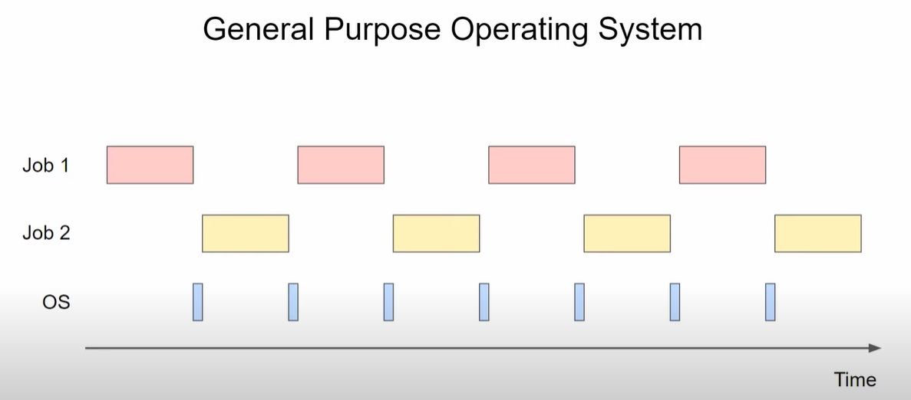
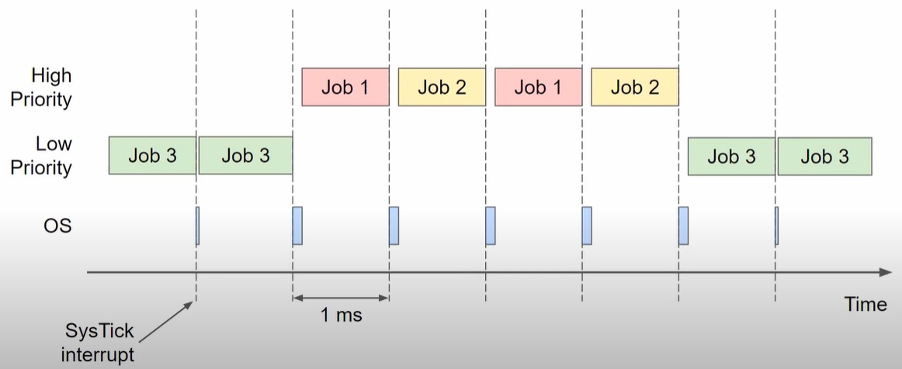

# FreeRTOS - tutorial:
## CMSIS FreeRTOS:
https://arm-software.github.io/CMSIS_6/latest/General/index.html
## FreeRTOS Documentation:
https://www.freertos.org/
## Tutrial link:
https://www.youtube.com/watch?v=OPrcpbKNSjU&list=PLEBQazB0HUyRYuzfi4clXsKUSgorErmBv&index=3
## General Purpose OS jobs schematic:

## SysTick Error:

